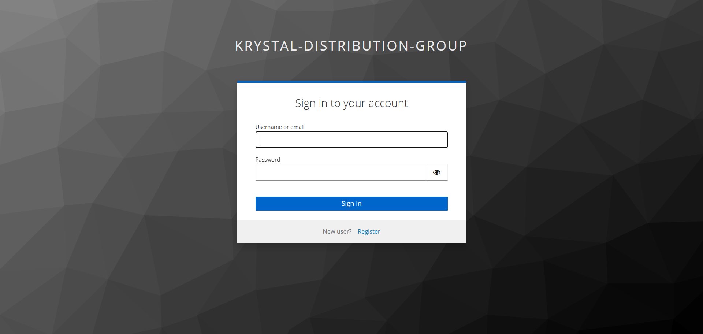
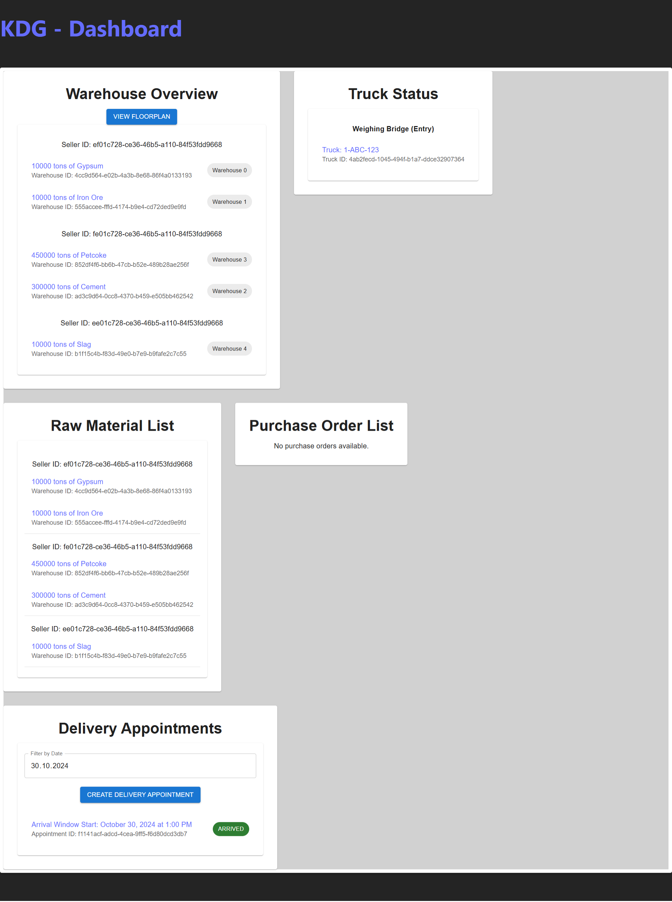
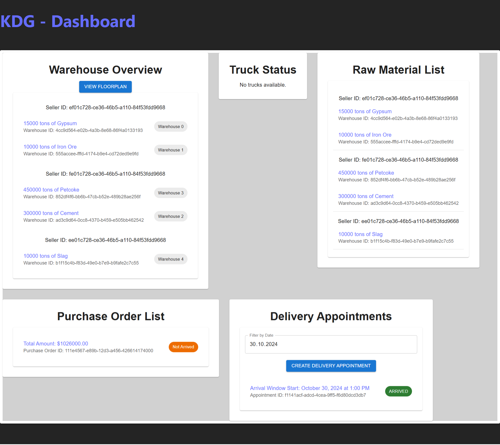
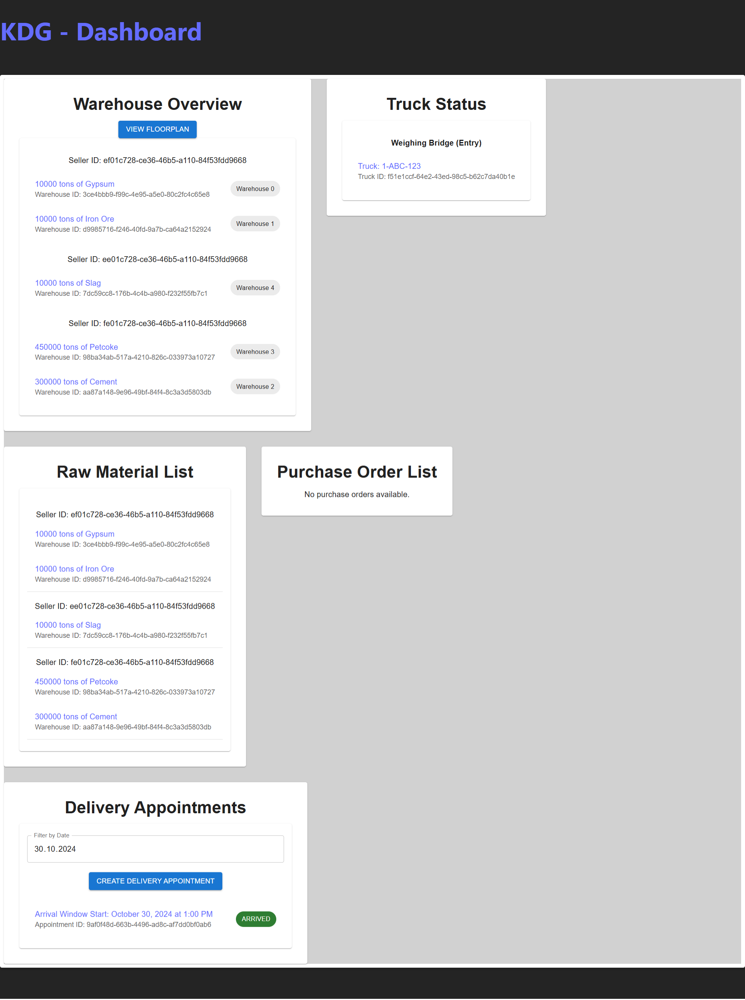
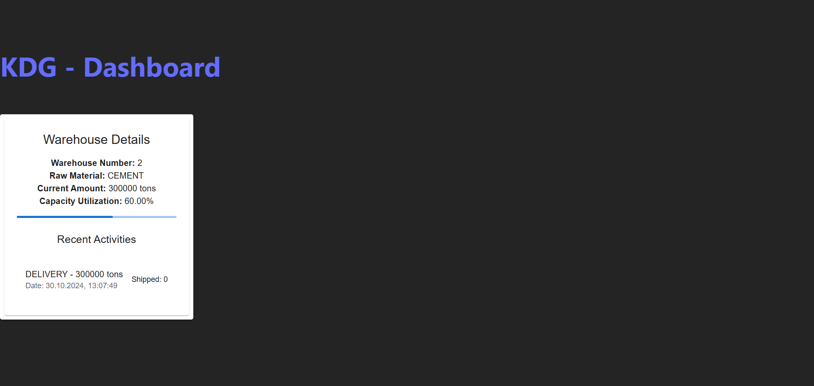
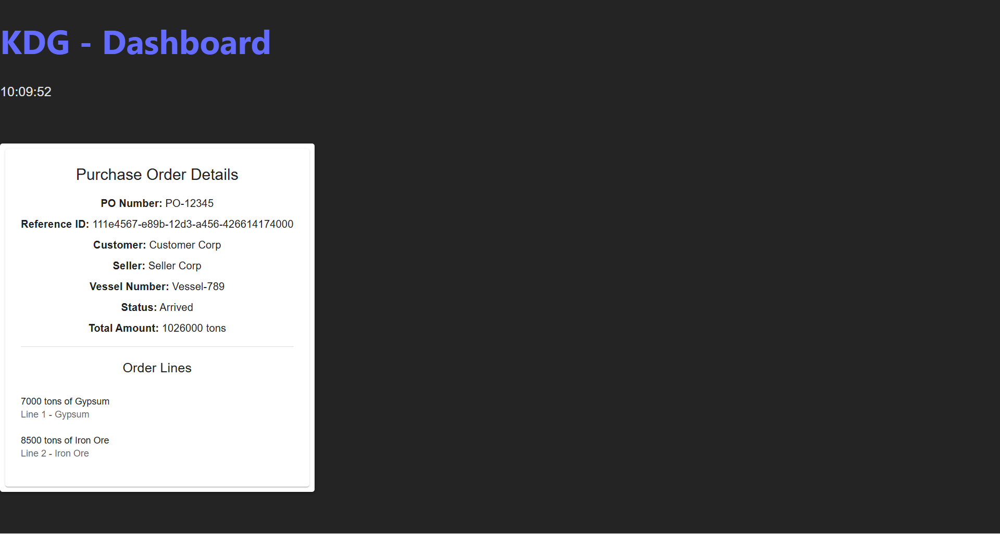
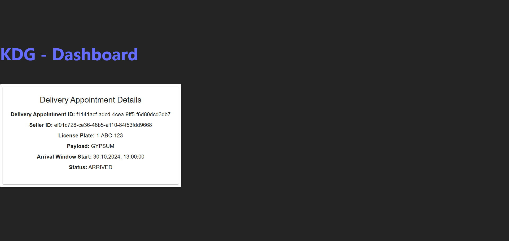
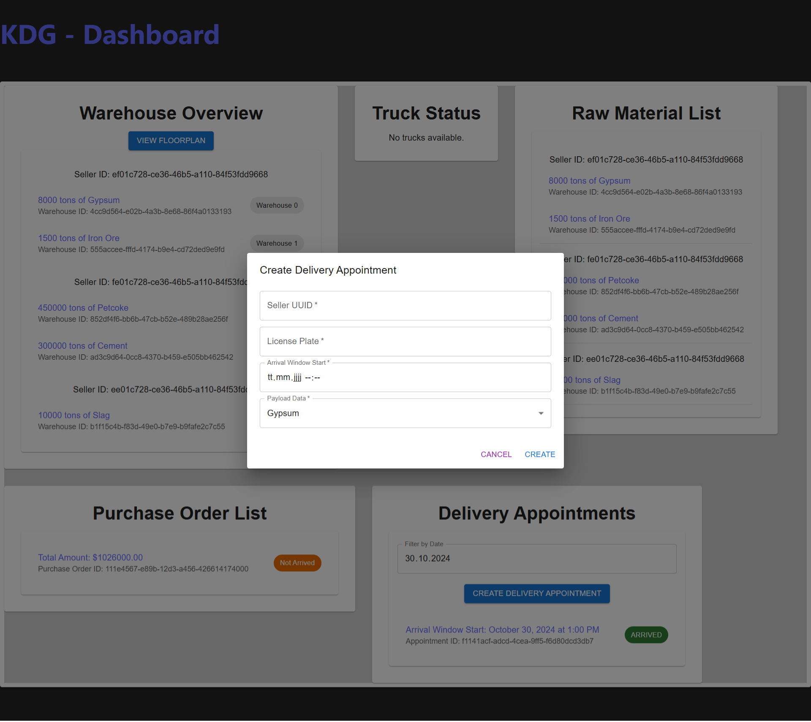
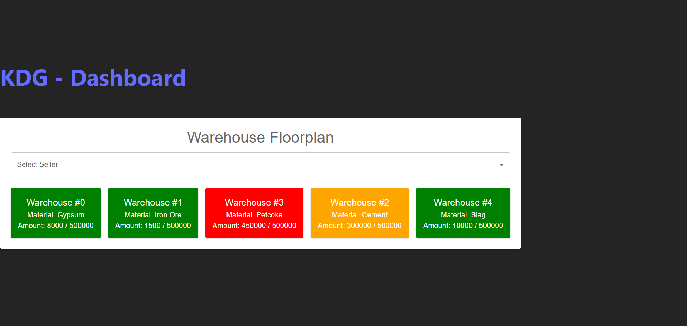
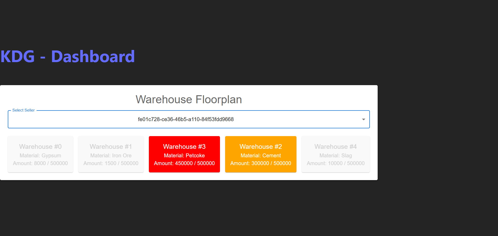

# Krystal Distribution Group

- Run all Requests from 'fakeDelivery.http' (backend) to create fake delivery events and create warehouses. Start with this when running the frontend.
- 'requests.http' (backend) to create delivery appointments, weigh trucks, and check license plates, etc...

## Screenshots

### Keycloak Login

### Dashboards

### Warehouse Details

### Purchase Order Details

### Delivery Appointment Details

### Delivery Appointment Form

### Floorplan

### Highlighted Floorplan

